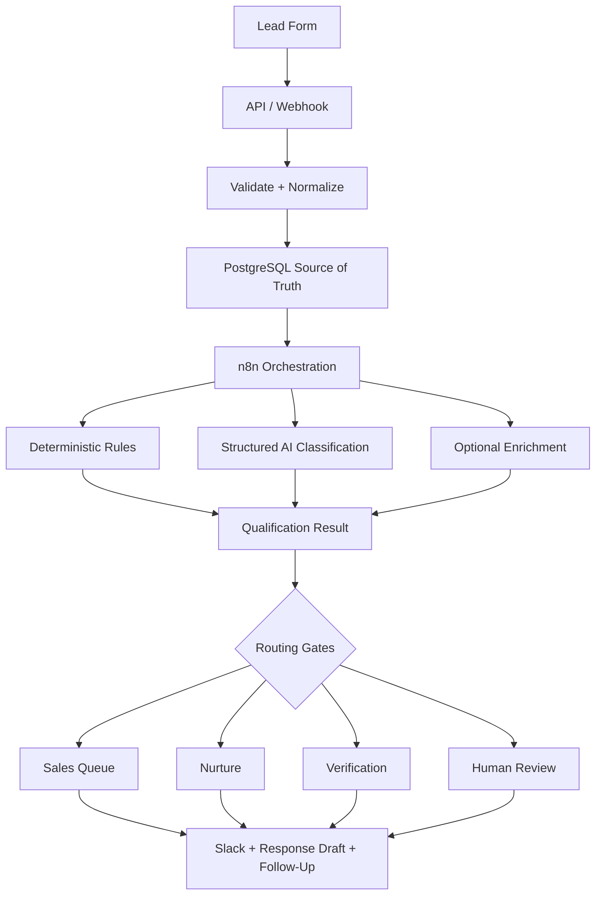

# Project Specification

This document imports the current working specification for **Project 01 — AI Lead Qualification & Follow-Up System** from [Notion](https://app.notion.com/p/3c4625677e33812eb756d45611bc3fe4).

## Project metadata

- **Status:** In progress
- **Priority:** High
- **Type:** Mock build
- **Fictional client:** Northstar Growth
- **Business:** US-based digital marketing and performance-marketing agency
- **Target leads:** B2B, SaaS, and e-commerce companies seeking paid acquisition or growth-marketing support
- **Business outcome:** Turn incoming agency leads into qualified, actionable opportunities with less manual work and faster follow-up

## Problem statement

Agency leads arrive through multiple channels and are manually reviewed, qualified, stored, assigned, contacted, and followed up. That process creates slow responses, inconsistent decisions, duplicate work, and missed opportunities.

The project will build an automation layer around the existing lead process. It is intended to demonstrate reliable, explainable automation—not an unsupervised sales agent or a replacement CRM.

## End-to-end outcome

A new lead should move through the following flow with minimal human intervention:

1. Capture the lead.
2. Validate and normalize the submission.
3. Resolve duplicate submissions or existing accounts.
4. Determine whether the data is sufficient for qualification.
5. Calculate a transparent qualification score.
6. Interpret qualitative information with structured AI output.
7. Evaluate risk and urgency independently.
8. Store the canonical lead and decision result.
9. Route the lead to the right operational queue.
10. Draft an appropriate personalized response.
11. Notify the responsible internal owner.
12. Schedule follow-up when no human action occurs.
13. Preserve a complete activity and workflow audit trail.

## User experience

### Lead-facing experience

The lead form should collect:

- Name and work email
- Company and website
- Role/title
- Company size
- Approximate annual revenue
- Monthly marketing or advertising budget
- Requested service
- Current challenge
- Lead source
- Free-form message

After submission, the lead receives a simple confirmation. Internal scores, AI classifications, routing rules, and risk assessments must never be exposed to the lead.

### Agency-facing experience

The internal team should receive a concise summary containing:

- Lead and company identity
- Qualification score and classification
- ICP fit and data-completeness status
- Requested service and budget
- Main pain point and buying intent
- Risk and urgency
- Recommended next action and response SLA

## Decision pipeline

```text
Lead submitted
  -> Validation gate
  -> Duplicate gate
  -> Qualification/data-completeness gate
  -> Score dimensions
  -> Risk gate
  -> Urgency gate
  -> Routing
  -> Action and follow-up
```

The score measures opportunity quality. Gates decide whether ordinary score-based routing is allowed to control the next action.

## Gate 1 — Validation

### States

- `VALID`: Data is sufficiently trustworthy; continue processing.
- `SUSPICIOUS`: Verify identity or request human review; do not score yet.
- `INVALID`: Submission is malformed, spam, or unusable; stop processing.

### V1 checks

- Required-field presence and basic normalization
- Email and URL syntax
- Disposable email detection
- Company-domain and email-domain consistency
- Obvious spam, gibberish, or repeated submission patterns
- Strong identity, company, or role inconsistencies

A free email address alone is not enough to mark a lead suspicious. Deterministic checks are authoritative; AI may only assist with interpreting unusual free-form content.

## Gate 2 — Duplicate detection

### States

- `NEW`
- `DUPLICATE_CONFIRMED`
- `POSSIBLE_DUPLICATE`
- Existing account with a new contact

### Matching hierarchy

1. Exact idempotency key: treat as an already-processed retry.
2. Normalized email: confirmed duplicate person.
3. Normalized name and company domain: probable duplicate.
4. Same company/domain with a different person: existing account, new contact.

Confirmed duplicates update the canonical record and append a new activity. They must not create another lead, resend the welcome message, or restart follow-up automation. Previous values and history remain preserved.

## Gate 3 — Qualification data

### States

- `SUFFICIENT`: Calculate the normal score.
- `PARTIAL`: Calculate a clearly labelled provisional score with lower confidence.
- `INSUFFICIENT`: Start a qualification workflow to collect missing information.

Core information includes company type, serviceability, authority, revenue, advertising budget, requested service, business problem, and buying context.

- **Sufficient:** About five of six score dimensions can be assessed, including ICP fit and either commercial value or buying intent.
- **Partial:** About three or four dimensions can be assessed.
- **Insufficient:** Fewer than three dimensions can be assessed, or the company/problem cannot be understood.

`UNKNOWN` is not equal to zero. Missing values remain `null` or unknown and trigger an information-gathering action rather than an automatic penalty.

## Qualification score

The score measures opportunity quality on a 100-point scale:

- Commercial value: 25
- ICP/company fit: 20
- Buying intent: 20
- Authority: 15
- Problem awareness: 10
- Geography/serviceability: 10

Base classification:

- `HOT`: 80–100
- `WARM`: 55–79
- `LOW_FIT`: 0–54

Urgency and risk never change this score.

### V1 scoring rubric

- **Commercial value:** Monthly ad spend is authoritative: `<$1k=2`, `$1k–4,999=8`, `$5k–14,999=15`, `$15k–49,999=22`, and `≥$50k=25`. If spend is unknown, annual revenue is the fallback: `<$250k=2`, `$250k–999k=8`, `$1m–4.99m=15`, `$5m–19.99m=22`, and `≥$20m=25`.
- **ICP fit:** Target industry contributes 12 points and target service contributes 8. Non-target values receive only their documented partial-fit points.
- **Buying intent:** Research `4`, diagnostic interest `10`, active help `15`, active evaluation or a defined decision window `20`.
- **Authority:** Individual contributor `3`, coordinator `4`, manager `8`, director/head `12`, and VP/founder/C-suite `15`.
- **Problem awareness:** Vague `2`, clear `5`, quantified `8`, and quantified with failed attempts or serious consequence `10`.
- **Geography:** United States `10`, supported English-speaking markets `7`, and other serviceable markets `4`.

Unknown dimensions remain `null`. A partial score is normalized as `earned / available maximum × 100`, is labelled provisional, and cannot produce a final confirmed classification.

## Gate 4 — Risk

### States

- `NORMAL`: Normal automation is allowed.
- `ELEVATED`: Continue while visibly flagging the concern.
- `HIGH`: Require senior human review before commitments or automatic progression.

Signals include guaranteed outcome demands, unrealistic performance expectations, severe scope/budget mismatch, unrealistic timelines, compliance concerns, and contradictory expectations.

Commercial value must never mathematically cancel risk. AI may extract risk evidence; deterministic business rules map that evidence to the risk state.

## Gate 5 — Urgency

- `CRITICAL`: Same-business-day action for immediate decisions, takeovers, or severe active problems.
- `HIGH`: Respond within 24 hours for active evaluation, a decision within roughly 30 days, or explicit near-term contact.
- `MEDIUM`: Respond within two to three business days when interest exists without an immediate deadline.
- `LOW`: Nurture future or research-stage opportunities.

Urgency measures response priority, not lead quality. A poor-fit lead can be urgent, while an excellent account can have low urgency.

## Routing precedence

Higher rules override lower rules:

```text
1. INVALID / SPAM
   -> STOP

2. SUSPICIOUS
   -> VERIFY_IDENTITY / HUMAN_REVIEW

3. DUPLICATE_CONFIRMED
   -> UPDATE_EXISTING_RECORD + APPEND_ACTIVITY

4. INSUFFICIENT DATA
   -> PRIORITY_QUALIFICATION or QUALIFICATION_WORKFLOW

5. HIGH RISK
   -> HUMAN_REVIEW

6. OTHERWISE
   -> SCORE + URGENCY ROUTING
```

### Normal routing

- Hot + Critical: `IMMEDIATE_ACTION`
- Hot + High: `PRIORITY_SALES`
- Hot + Medium: `HOT_SALES_QUEUE`
- Hot + Low: `HIGH_VALUE_NURTURE`
- Warm + Critical/High: `PRIORITY_QUALIFICATION`
- Warm + Medium: `NORMAL_SALES_QUEUE`
- Warm + Low: `NURTURE`
- Low fit + Critical/High: `QUICK_HUMAN_CHECK`
- Low fit + Medium/Low: `LOW_PRIORITY` or `NURTURE`

## Follow-up state machine

- **T+0:** Submission confirmation
- **T+24 hours:** Check the current lead status
- **T+72 hours:** Send a follow-up when appropriate
- **T+7 days:** Send the final follow-up or move to nurture

Stop automation immediately if a person replies, books a meeting, rejects the lead, or manually changes its status.

## AI responsibilities

Use structured AI output for:

- Pain-point extraction and summary
- Buying-intent classification
- Interpretation of ambiguous qualitative information
- Evidence extraction with confidence
- Risk-signal extraction
- Suggested next action
- Personalized outreach draft

Do not allow the model to invent the final score, fabricate enrichment data, or independently bypass deterministic gates.

## Canonical qualification output

The qualification engine emits one structured result per processed submission. This machine-readable object is authoritative; Slack messages, dashboards, reports, emails, and CRM views must render from it rather than reinterpreting the lead independently.

```json
{
  "lead": {
    "company": "ScaleFlow",
    "contact_name": "Sarah Chen",
    "role": "VP Marketing",
    "email": "sarah@scaleflow.com",
    "website": "https://scaleflow.com",
    "source": "website_form"
  },
  "decision": {
    "classification": "HOT",
    "score": 91,
    "data_completeness": 95,
    "confidence": "HIGH"
  },
  "gates": {
    "validation": "VALID",
    "duplicate": "NEW",
    "qualification_data": "SUFFICIENT",
    "risk": "NORMAL",
    "urgency": "HIGH"
  },
  "scores": {
    "commercial_value": 20,
    "icp_fit": 20,
    "buying_intent": 18,
    "authority": 14,
    "problem_awareness": 10,
    "geography_serviceability": 9,
    "total": 91
  },
  "analysis": {
    "problem_summary": "Paid acquisition performance has deteriorated.",
    "intent_summary": "Actively seeking external help.",
    "key_signals": ["$30k monthly ad spend", "VP-level authority"],
    "missing_information": [],
    "risk_signals": [],
    "evidence": [
      {
        "type": "problem_awareness",
        "source_text": "Our CPL has increased roughly 40%.",
        "confidence": 0.96
      }
    ]
  },
  "routing": {
    "route": "PRIORITY_SALES",
    "recommended_action": "Assign a sales owner and contact within 24 hours.",
    "sla_hours": 24,
    "follow_up_sequence": "hot_lead"
  }
}
```

Early-termination results may omit downstream scoring fields when a lead is invalid, suspicious, duplicated, or too incomplete to assess.

## Test scenarios

1. **ScaleFlow — Hot:** Strong SaaS fit, VP authority, roughly $30k monthly ad spend, quantified pain, and high urgency.
2. **BrightDesk — Warm:** Strong problem and founder contact, but smaller commercial scale and roughly $4k monthly spend.
3. **Bella's Local Bakery — Low fit:** Very small local business with a limited marketing budget and weak agency fit.
4. **NovaCommerce — Hot:** Large UK e-commerce account with strong authority, roughly $70k monthly spend, declining ROAS, and a 30-day decision window. Geography reduces rather than disqualifies.
5. **GrowthLoop AI — Unconfirmed/high urgency:** Strong pain and near-term contact request, but commercial and authority data are missing. Collect information quickly rather than rejecting.
6. **TitanCommerce — Warm/nurture:** Excellent account potential with roughly $150k monthly spend, but low current intent and a coordinator-level contact.
7. **Apex Commerce — Hot/high risk:** Exceptional commercial fit and critical urgency, but a demand for guaranteed 5x ROAS within 30 days requires senior review.
8. **Suspicious Google submission — Verify:** Claimed company and CEO identity conflict with a generic email address and implausible values. Validate before qualification.
9. **Duplicate ScaleFlow submission — Update:** Merge new context into the canonical lead, preserve history, append an activity, and do not restart follow-up.
10. **OrbitLabs — Consultative hot opportunity:** Strong fit, authority, and problem awareness with medium intent. Offer a diagnostic conversation before pitching a retainer.

Step 1 is complete only when the implementation reproduces the intended outcomes across this full test set.

## Functional requirements

- [ ] Lead capture endpoint and form
- [ ] Input validation and normalization
- [ ] Idempotency and duplicate resolution
- [ ] Central lead storage
- [ ] Deterministic scoring engine
- [ ] Structured AI classification and summary
- [ ] Gate and routing engine
- [ ] Slack notification
- [ ] Personalized response draft
- [ ] Follow-up scheduler/state machine
- [ ] Human override
- [ ] Workflow status and activity log
- [ ] Retry handling for temporary failures

## Non-functional requirements

- **Reliability:** Temporary integration failures must never silently lose a lead.
- **Idempotency:** Retried webhook events must not create duplicate leads or actions.
- **Observability:** Important steps, statuses, durations, and errors must be logged.
- **Security:** Credentials and secrets must not be hard-coded.
- **Privacy:** Avoid unnecessary transmission of personally identifiable information.
- **Cost awareness:** Do not call an LLM when deterministic logic is sufficient.
- **Explainability:** Scores and AI classifications must retain factor-level reasons and evidence.
- **Human control:** AI output and routing decisions must remain overridable.

## Planned architecture



## Technology stack

- **Web application:** Next.js and TypeScript
- **Source of truth:** Supabase and PostgreSQL
- **Orchestration:** n8n
- **AI:** OpenAI structured outputs
- **Notifications:** Slack
- **Email:** Simulated/generated content first; transactional delivery after the core workflow is stable
- **Deployment:** Vercel, Supabase, Docker, and GitHub CI/CD

Suggested tables: `leads`, `lead_scores`, `activities`, `workflow_runs`, and `follow_ups`.

## Verifiable demo metrics

- End-to-end workflow completion rate
- Average lead-processing time
- Duplicate-prevention success
- Classification and routing consistency on the test dataset
- Error-recovery behavior
- Manual steps removed from the simulated workflow

Do not claim conversion, productivity, or revenue improvement without real measured evidence.

## Out of scope for V1

- Full CRM product
- Complex multi-user administration portal
- Autonomous sales-agent conversations
- Production-grade email-deliverability system
- Paid enrichment providers unless clearly justified
- Multi-tenant architecture
- Real-client ROI claims

## Build sequence

- [ ] 1. Validate V1 decision rules against all test scenarios
- [ ] 2. Design the PostgreSQL/Supabase schema
- [ ] 3. Build the lead form and capture API
- [ ] 4. Implement deterministic scoring
- [ ] 5. Add structured AI classification
- [ ] 6. Build n8n orchestration
- [ ] 7. Add routing and Slack notifications
- [ ] 8. Add the follow-up state machine
- [ ] 9. Add logging, retries, and failure handling
- [ ] 10. Automate the test dataset and evaluate outcomes
- [ ] 11. Record the demo
- [ ] 12. Publish the case study and supporting portfolio content

## Current next step

The V1 foundation now implements the decision pipeline, test fixtures, schema, public form, demo dashboard, an n8n Agent structured-analysis path, and a versioned combined orchestration workflow. The application validates agent output and retains deterministic ownership of scoring and routing. The next operational step is to connect the n8n OpenAI credential, configure the application environment, apply the Supabase migration, and run the same acceptance suite against local and deployed environments.
