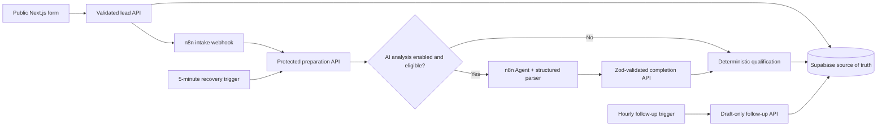

# Project 01 — Technical Review

## Review outcome

The V1 implementation satisfies the core portfolio requirements for a production-minded lead qualification and follow-up automation. The system keeps business decisions in a pure TypeScript domain, persists accepted submissions before orchestration, uses n8n for workflow coordination, and keeps uncertain or failed processing under human control.

## Architecture

## Requirement assessment

- **Validation gate:** Zod validates lead input and protected workflow boundaries. Deterministic checks own validity and suspicious states.
- **Duplicate gate:** idempotency keys prevent replay; normalized email detects confirmed duplicate people; duplicate submissions update the canonical lead and append activity rather than restarting automation.
- **Qualification-data gate:** sufficient, partial, and insufficient states preserve uncertainty. Unknown dimensions remain `null`, never zero.
- **Scoring:** explicit 100-point rubric across commercial value, ICP fit, buying intent, authority, problem awareness, and geography. Partial scores are normalized and labelled provisional.
- **Risk and urgency:** evaluated independently from score. High risk forces human review; urgency controls SLA rather than lead quality.
- **Routing:** precedence protects invalid, suspicious, duplicate, insufficient-data, and high-risk cases before normal score-and-urgency routing.
- **AI boundary:** AI is opt-in and n8n-owned. It cannot calculate scores or bypass gates. Disabled analysis completes deterministically with `aiStatus: SKIPPED`; provider failure routes safely to human review.
- **Persistence:** Supabase contains seven V1 tables with RLS enabled and no anonymous policies.
- **Retries:** external HTTP nodes retry up to three times with a two-second delay. A five-minute recovery trigger reprocesses persisted pending submissions.
- **Follow-up:** an hourly trigger converts due checkpoints into drafts only; no real email is sent in V1.
- **Auditability:** submissions, qualification results, workflow runs, activities, follow-ups, and outbound drafts are persisted separately.
- **Security/privacy:** public responses expose only receipt state and submission ID. Secrets remain server-side and portable workflow JSON contains no credentials.

## Verification evidence

- `pnpm check` passed formatting, lint, TypeScript, 21 tests, and a production Next.js build.
- Ten fixture scenarios reproduce Hot, Warm, Low Fit, insufficient data, nurture, high risk, suspicious identity, duplicate, and consultative routes.
- n8n production execution `34` verified confirmed-duplicate routing without an AI call.
- n8n production execution `35` verified the AI failure boundary and safe `HUMAN_REVIEW` completion.
- n8n manual execution `39` verified recovery polling with no pending submissions.
- n8n manual execution `38` verified hourly draft-only follow-up processing with no due checkpoints.
- The production form persisted test leads and returned public receipt identifiers without exposing internal decisions.

## Measurable technical outcomes

- 10 representative routing scenarios covered.
- 21 automated tests passing.
- 14 n8n nodes across 3 trigger branches.
- 7 PostgreSQL tables protected by RLS.
- 3 retry attempts configured for each external application call.
- 5-minute recovery interval and hourly follow-up interval.
- Zero real outbound emails in V1; follow-up remains draft-only.

## Residual production considerations

- Protect `/dashboard` before using real lead data.
- Configure Slack only if internal notifications are required.
- Set `AI_ANALYSIS_ENABLED=true` only with funded provider credentials and usage limits.
- Add real-user operational metrics before making ROI or conversion claims.
